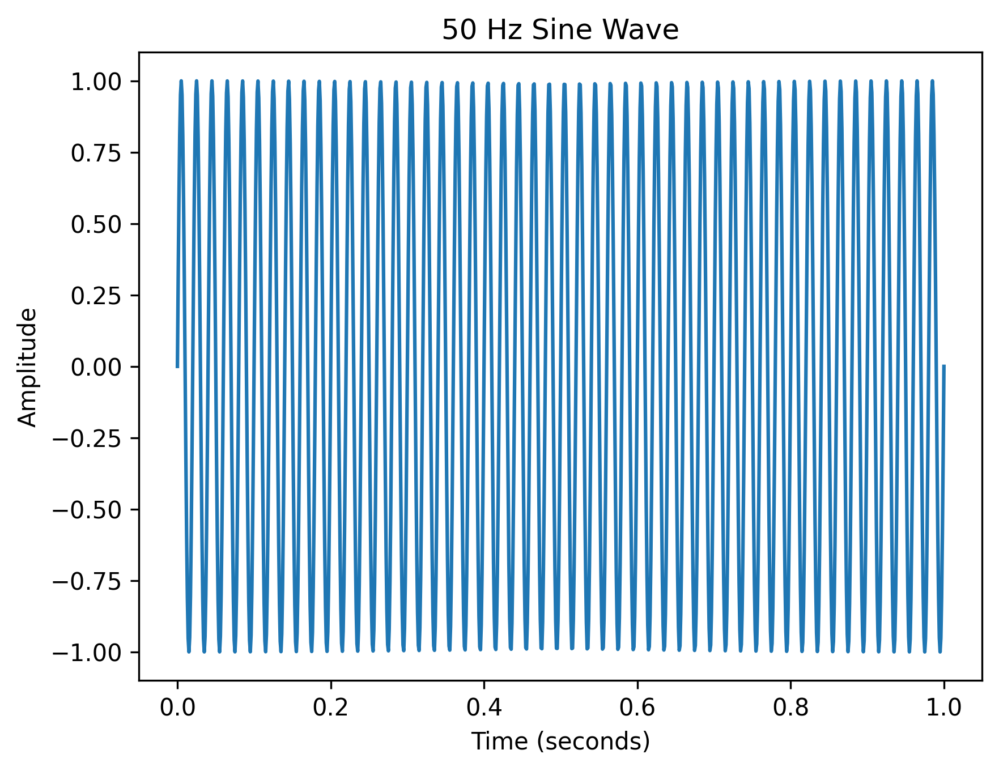

EXP-01: 50 Hz Sine Wave Generation

Objective:Generate and visualize a 50 Hz sinusoidal signal in the time domain.
Theory:A sinusoidal signal is represented as:
x(t) = A sin(2πft)
where:
- A = amplitude
- f = frequency
- t = time

For this experiment:
- Amplitude = 1
- Frequency = 50 Hz
- Duration = 1 second
- Number of samples = 1000

Method:A time vector was generated using NumPy and a 50 Hz sine wave was calculated using:
x(t) = sin(2π50t)
The resulting signal was plotted using Matplotlib.

Result:

Observation:The signal is periodic and completes approximately 50 cycles during the 1-second observation interval.

Conclusion:A 50 Hz sinusoidal signal was successfully generated and visualized in the time domain.

Next Experiment:Generate a signal containing multiple frequency components and investigate how the time-domain waveform changes.
