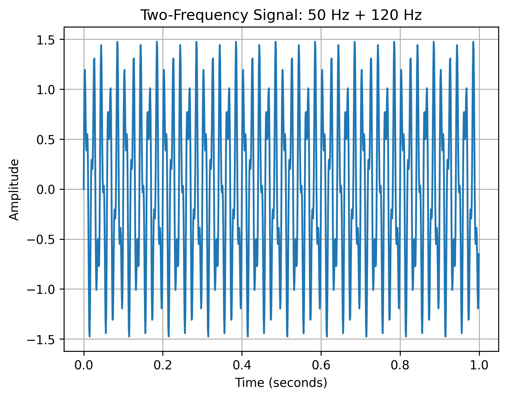

# EXP-02: Two-Frequency Signal

## Objective

Generate a composite signal containing two sinusoidal frequency components: 50 Hz and 120 Hz.

## Signal

The signal is defined as:

x(t) = sin(2π50t) + 0.5sin(2π120t)

Therefore, it contains:

- 50 Hz component with amplitude 1
- 120 Hz component with amplitude 0.5

## Parameters

| Parameter | Value |
|---|---:|
| Sampling frequency | 1000 Hz |
| Duration | 1 second |
| Number of samples | 1000 |
| Component 1 | 50 Hz |
| Amplitude 1 | 1 |
| Component 2 | 120 Hz |
| Amplitude 2 | 0.5 |
| Nyquist frequency | 500 Hz |
| Frequency resolution | 1 Hz |

## Method

1. Generate a time vector sampled at 1000 Hz.
2. Generate a 50 Hz sinusoid.
3. Generate a 120 Hz sinusoid with half the amplitude.
4. Add the two signals.
5. Plot the resulting composite signal.

## Result

## Observation

The composite waveform is more complicated than the single 50 Hz sinusoid from EXP-01 because two different frequency components are superimposed.

The individual frequency components are not immediately obvious from the time-domain waveform.

## Conclusion

A composite signal containing 50 Hz and 120 Hz components was successfully generated.

This signal will be used as a known test signal for FFT analysis.

## Next Experiment

Apply the Fast Fourier Transform (FFT) to identify the frequency components present in the signal.
