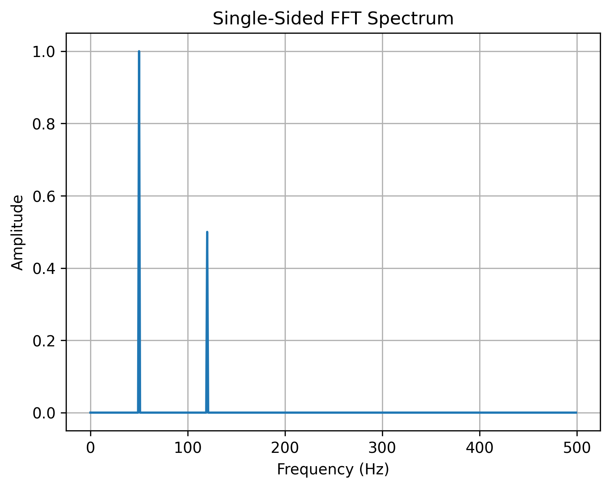

# EXP-03: FFT Analysis

## Objective

Use the Fast Fourier Transform (FFT) to identify the frequency
components present in the signal generated in EXP-02.

## Input Signal

x(t) = sin(2π50t) + 0.5sin(2π120t)

The expected components are:

- 50 Hz with amplitude 1
- 120 Hz with amplitude 0.5

## Parameters

| Parameter | Value |
|---|---:|
| Sampling frequency | 1000 Hz |
| Duration | 1 second |
| Number of samples | 1000 |
| Frequency resolution | 1 Hz |
| Nyquist frequency | 500 Hz |

## Method

1. Generate the composite signal.
2. Calculate the FFT using NumPy.
3. Calculate the magnitude spectrum.
4. Normalize by the number of samples.
5. Convert the spectrum to a single-sided representation.
6. Plot amplitude versus frequency.

## Result

## Observation

Two dominant peaks are observed near 50 Hz and 120 Hz.

The peak near 50 Hz corresponds to the first sinusoidal
component, while the peak near 120 Hz corresponds to the
second component.

The relative peak amplitudes are approximately 1 and 0.5.

## Conclusion

FFT successfully identified the frequency components present
in the composite time-domain signal.

This demonstrates the usefulness of frequency-domain analysis
for identifying periodic components that are difficult to
distinguish directly from the time-domain waveform.

## Next Experiment

Investigate the effect of noise on FFT-based frequency analysis.
