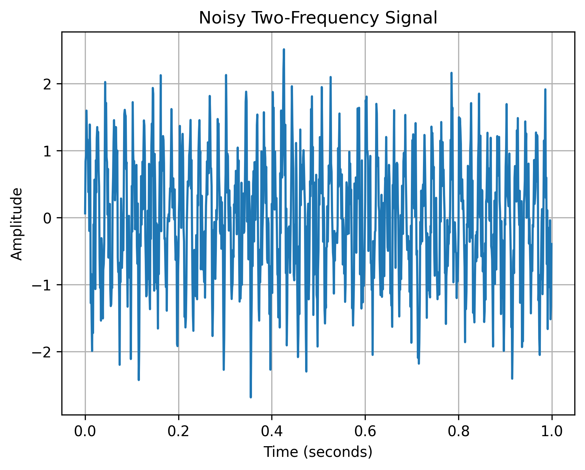
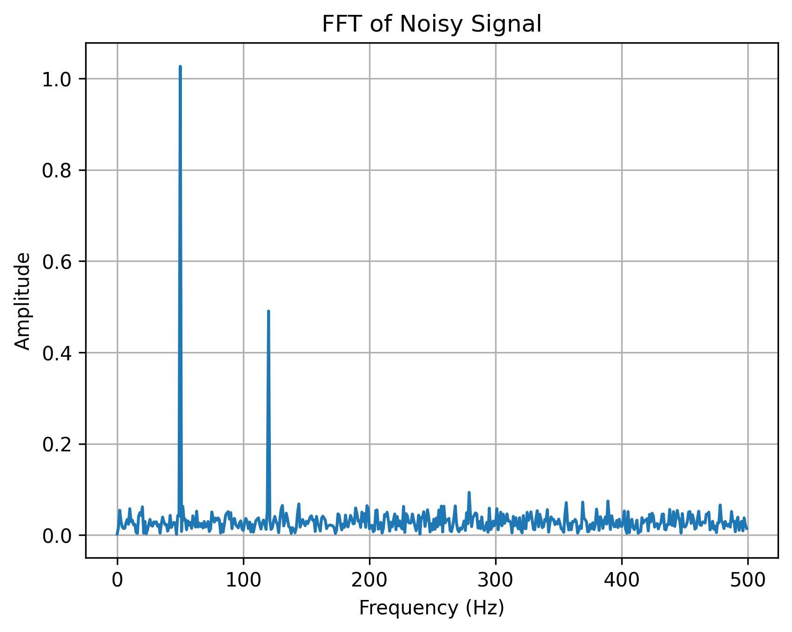

# EXP-04: Noisy Signal Analysis

## Objective

Investigate how additive Gaussian noise affects a composite signal
and whether frequency-domain analysis can still identify its
dominant frequency components.

## Input Signal

The clean signal is:

x(t) = sin(2π50t) + 0.5sin(2π120t)

Gaussian noise is then added:

x_noisy(t) = x(t) + n(t)

## Parameters

| Parameter | Value |
|---|---:|
| Sampling frequency | 1000 Hz |
| Duration | 1 second |
| Number of samples | 1000 |
| Signal 1 | 50 Hz |
| Signal 2 | 120 Hz |
| Amplitude 1 | 1 |
| Amplitude 2 | 0.5 |
| Noise type | Gaussian |
| Noise scale | 0.5 |

## Method

1. Generate the clean two-frequency signal.
2. Generate Gaussian random noise.
3. Add the noise to the clean signal.
4. Visualize the noisy waveform.
5. Calculate the FFT of the noisy signal.
6. Plot the single-sided frequency spectrum.

## Noisy Time-Domain Result

## FFT Result

## Observation

Adding noise makes the time-domain waveform less smooth and makes
the original periodic components more difficult to identify visually.

However, the FFT still shows dominant components around 50 Hz and
120 Hz above the surrounding noise floor.

## Conclusion

Frequency-domain analysis can help identify dominant periodic
components even when the time-domain signal is affected by noise.

## Next Experiment

Apply digital filtering to reduce unwanted noise while preserving
the important signal components.
