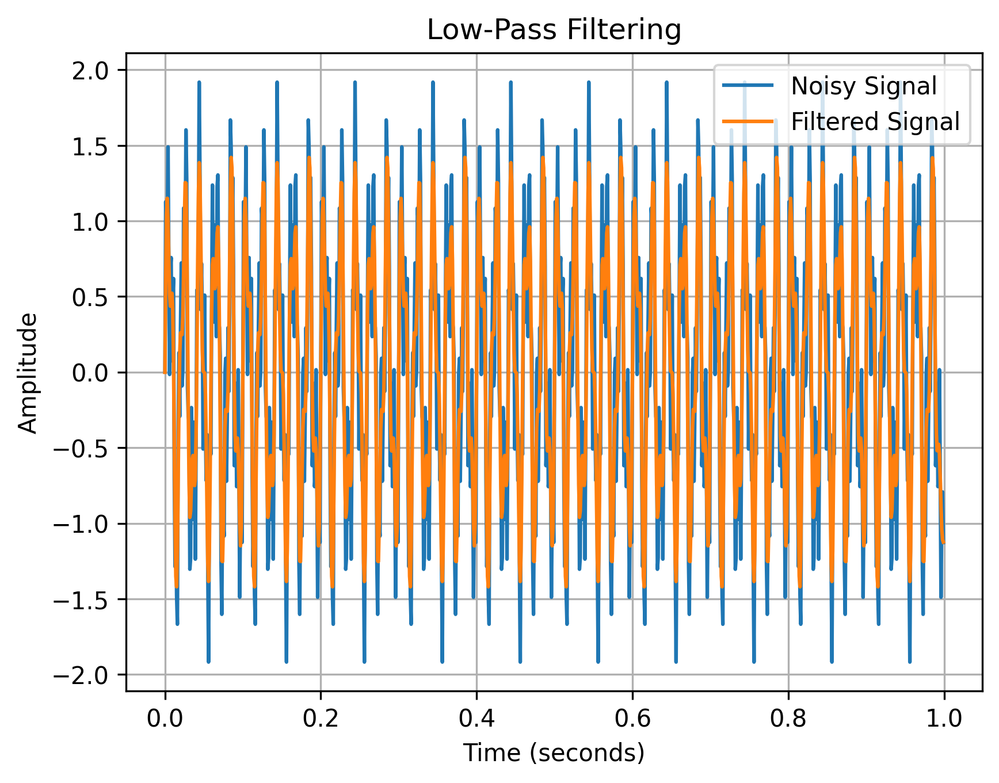
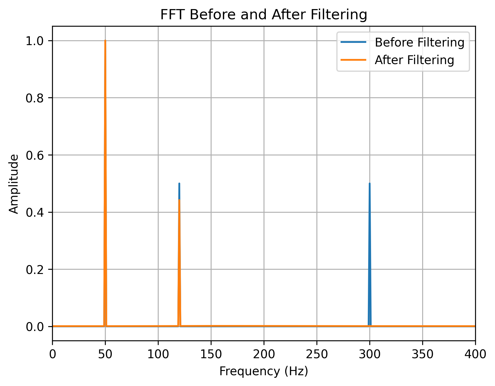

# EXP-05: Digital Filtering

## Objective

Investigate how a digital low-pass filter can suppress unwanted
high-frequency components while preserving lower-frequency signal
components.

## Input Signal

The signal contains:

- 50 Hz useful component
- 120 Hz useful component
- 300 Hz unwanted high-frequency component

The signal is:

x(t) = sin(2π50t) + 0.5sin(2π120t) + 0.5sin(2π300t)

## Filter

A 4th-order Butterworth low-pass filter was used.

| Parameter | Value |
|---|---:|
| Sampling frequency | 1000 Hz |
| Cutoff frequency | 150 Hz |
| Filter order | 4 |
| Filter type | Low-pass |

## Expected Behavior

The 50 Hz and 120 Hz components should be largely preserved,
while the 300 Hz component should be strongly attenuated.

## Time-Domain Result

## Frequency-Domain Comparison

## Observation

The noisy signal contains a high-frequency component around
300 Hz.

After applying the 150 Hz low-pass filter, the 300 Hz component
is strongly attenuated while the 50 Hz and 120 Hz components
remain.

## Conclusion

Digital filtering can be used to reduce unwanted frequency
components before performing further vibration-signal analysis.

## Next Experiment

Investigate how filter parameters such as cutoff frequency and
filter order affect the resulting signal.
