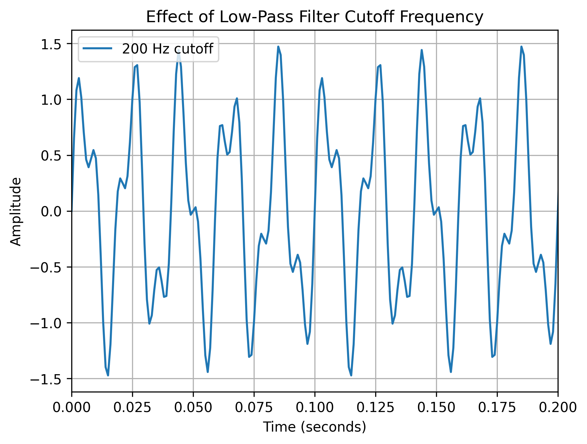

# EXP-06: Filter Parameter Study

## Objective

Investigate how the cutoff frequency of a low-pass filter affects
the preservation and suppression of different frequency components.

## Test Signal

The test signal contains:

x(t) = sin(2π50t) + 0.5sin(2π120t) + 0.5sin(2π300t)

Therefore:

| Component | Frequency | Purpose |
|---|---:|---|
| Signal 1 | 50 Hz | Useful |
| Signal 2 | 120 Hz | Useful |
| Signal 3 | 300 Hz | Unwanted |

## Filter

A 4th-order Butterworth low-pass filter was used.

The following cutoff frequencies were tested:

- 80 Hz
- 150 Hz
- 200 Hz

## Result

## Analysis

### 80 Hz cutoff

The 50 Hz component is preserved, but the 120 Hz component is
strongly attenuated.

### 150 Hz cutoff

Both 50 Hz and 120 Hz components are preserved while the 300 Hz
component is significantly attenuated.

### 200 Hz cutoff

Both useful components are preserved, but more high-frequency
content is allowed to pass compared with the 150 Hz filter.

## Conclusion

Filter cutoff frequency must be selected based on the frequencies
that contain useful information.

An overly aggressive filter can remove important signal
components along with unwanted noise.

## Key Lesson

Filtering should be based on knowledge of the signal's frequency
content rather than choosing a cutoff frequency arbitrarily.

## Next Experiment

Move from synthetic signals to real vibration/sensor data.
