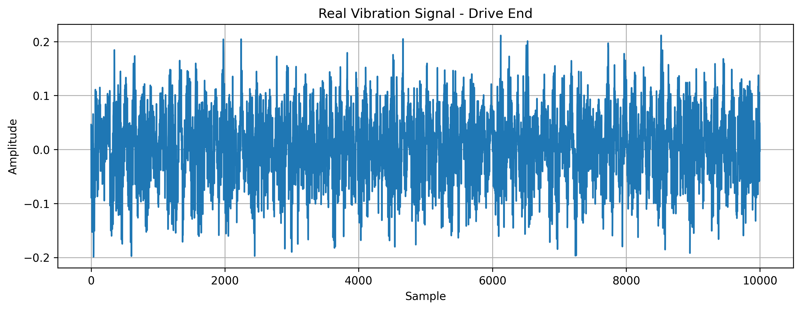
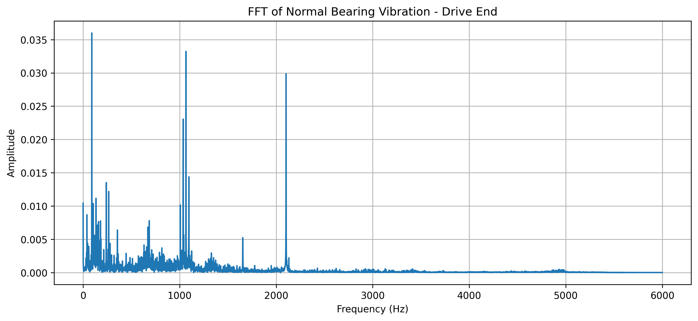
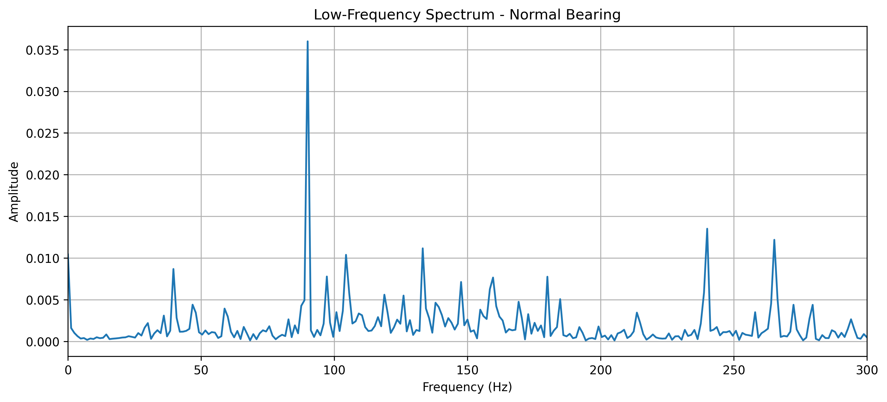

# EXP-07: Real Vibration Data Analysis

## Objective

Analyze vibration measurements from a real rotating-machine
dataset instead of using mathematically generated signals.

This experiment introduces real-world vibration data into the
predictive-maintenance pipeline.

---

## Dataset

The dataset used is the Case Western Reserve University (CWRU)
Bearing Dataset.

Source:

Case Western Reserve University Bearing Data Center

The raw dataset is not stored in this repository.

---

## Dataset File

The file analyzed in this experiment is:

`98.mat`

This file represents a normal bearing condition under a 1 HP
motor load.

---

## Signal Used

The Drive End vibration signal was selected:

`X098_DE_time`

The signal contains approximately 483,903 samples.

The Fan End signal is also available:

`X098_FE_time`

but is not used in the first analysis.

---

## Sampling Frequency

The signal is analyzed using a sampling frequency of:

`12,000 Hz`

Therefore, the Nyquist frequency is:

`6,000 Hz`

---

## Analysis Pipeline

The experiment follows this pipeline:

Raw vibration data

↓

Signal inspection

↓

Time-domain visualization

↓

FFT

↓

Frequency-domain visualization

↓

Low-frequency analysis

---

## Results

### Raw Vibration

The real vibration signal is considerably more complex than the
synthetic signals used in earlier experiments.

---

### FFT Spectrum

The FFT reveals the frequency components present in the vibration
signal.

---

### Low-Frequency Spectrum

The low-frequency region is examined separately to make
rotational and other dominant components easier to identify.

---

## Important Observation

This experiment represents a normal bearing condition.

The frequency peaks observed in the spectrum should therefore
not automatically be interpreted as faults.

A faulty-bearing dataset will be analyzed separately and
compared with this baseline.

---

## Next Step

The next stage is to:

1. Identify dominant frequency peaks.
2. Relate them to machine rotational speed.
3. Obtain a faulty-bearing dataset.
4. Compare healthy and faulty spectra.
5. Extract useful vibration features.
