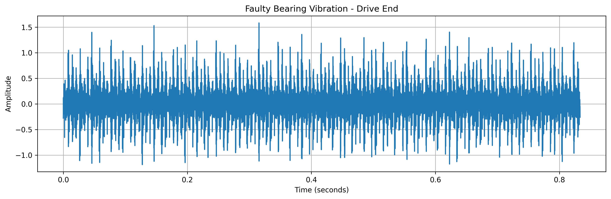
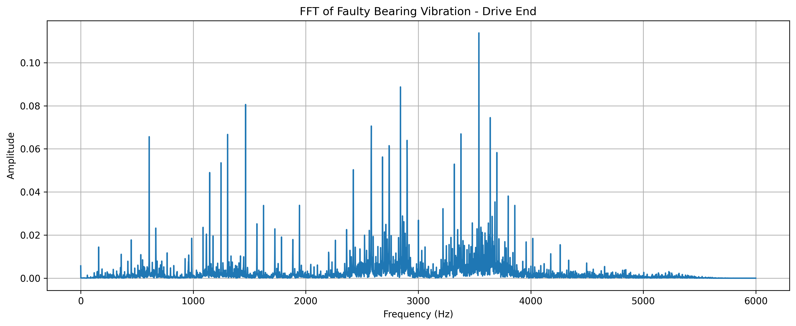
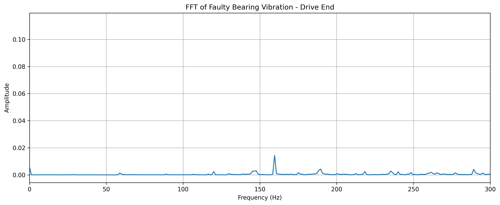
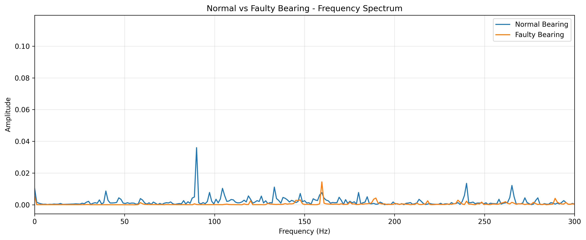
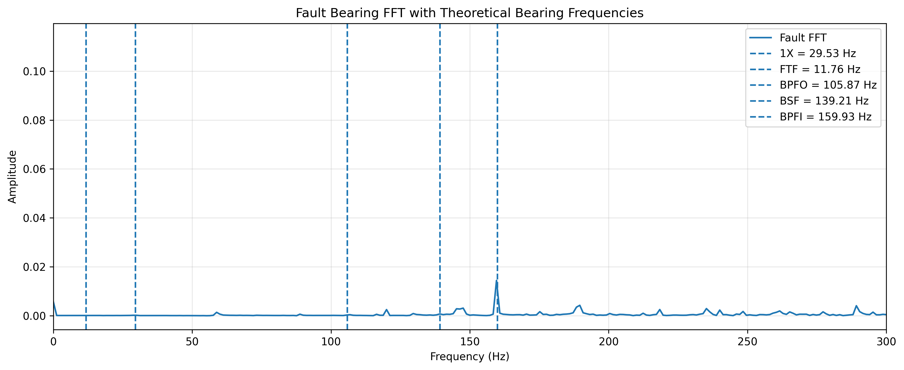

# EXP-08: Fault Vibration Data Analysis

## Objective

Analyze a known faulty bearing vibration signal and compare it
with the normal bearing baseline from EXP-07.

The purpose of this experiment is to investigate how a known
bearing fault changes the vibration signal in both the
time domain and frequency domain.

## Dataset

Case Western Reserve University (CWRU) Bearing Dataset.

The raw `.mat` dataset files are not stored in this repository.

### Dataset File

`106.mat`

This file represents a known inner-race bearing fault,
approximately 0.007 inch, under the 1 HP operating condition.

### Signal Used

Drive End vibration:

`X106_DE_time`

Sampling frequency:

`12,000 Hz`

## Analysis Performed

The experiment performs:

1. Faulty vibration signal inspection
2. Time-domain visualization
3. Fast Fourier Transform (FFT)
4. Low-frequency spectrum analysis
5. Normal vs faulty FFT comparison
6. Frequency peak detection
7. Theoretical bearing-frequency calculation
8. Vibration feature extraction

## Faulty Vibration Signal

## Fault FFT Spectrum

## Low-Frequency Spectrum

## Normal vs Faulty FFT

## Bearing Frequency Analysis

The theoretical bearing characteristic frequencies were calculated
using the approximate 1772 RPM operating speed and the CWRU bearing
geometry.

The calculated components include:

- 1X rotational frequency
- Fundamental Train Frequency (FTF)
- Ball Pass Frequency Outer Race (BPFO)
- Ball Spin Frequency (BSF)
- Ball Pass Frequency Inner Race (BPFI)

## Frequency Peak Analysis

Detected frequency peaks are stored in:

`fault_peak_analysis.csv`

The analysis focuses on frequencies up to 300 Hz.

## Vibration Features

The following time-domain features were extracted:

- Mean
- Standard deviation
- RMS
- Peak amplitude
- Peak-to-peak amplitude
- Crest factor
- Kurtosis

The normal and faulty feature values are stored in:

`normal_vs_fault_features.csv`

The faulty-bearing feature values are stored in:

`vibration_features.csv`

## Important Interpretation Note

A single frequency component should not by itself be treated as
proof of a bearing fault.

This experiment uses a known faulty dataset and compares it with
a known normal baseline. Both time-domain and frequency-domain
features are considered.

## Reproducibility

The analysis code is provided in:

`fault_vibration.py`

The raw CWRU `.mat` files are intentionally excluded from this
repository.

## Next Step

The extracted vibration features will be used to construct a
machine-learning dataset for bearing-condition classification.
